# 🎓 SDD Avanzado: Patrones para Equipos

👨‍🏫 **Del Instructor**: Ya dominas el flujo básico. Ahora veremos cómo escalar SDD para proyectos reales: brownfield, equipos grandes, y CI/CD.

> 💭 **Mentalidad de Tech Lead**: "La metodología que funciona para un desarrollador debe escalar para un equipo de 50, o no es metodología, es hobby."

---

## 🏗️ Brownfield vs Greenfield

### Greenfield (Proyecto Nuevo)

**Características**:

- Sin código legacy
- Sin restricciones arquitecturales
- Stack moderno por defecto

**SDD Approach**:

```text
/sdd:init --mode openspec
→ Detecta: Sin tech stack
→ Pregunta: ¿Qué stack prefieres?
→ Crea config.yaml limpio
```

**Ventajas**:

- ✅ Specs definen arquitectura desde cero
- ✅ Sin conflictos con código existente
- ✅ Testing setup limpio

---

### Brownfield (Proyecto Existente)

**Características**:

- Código legacy
- Restricciones arquitecturales
- Tests existentes (o ninguno)

**SDD Approach**:

```text
/sdd:init --mode openspec
→ Detecta: PHP 7.4, Laravel 5, MySQL
→ Detecta: Sin tests
→ Crea config.yaml con restricciones

rules:
  apply:
    - Follow existing Laravel patterns
    - Use Eloquent ORM (no raw SQL)
    - PHP 7.4 compatible (no typed properties)
```

**Desafíos y Soluciones**:

| Desafío | Solución |
|---------|----------|
| Sin tests | Fase de testing explícita en tasks |
| Código legacy | Refactor gradual, spec primero |
| Documentación faltante | EXPLORE antes de cada cambio |

**Patrón: Spec Retrospectivo**

```markdown
# Para código existente sin specs

/sdd:explore current-auth-flow
→ Documenta lo que existe

/sdd:spec --retrospective
→ Crea spec para código existente
→ Útil como baseline para refactors
```

---

## 👥 SDD en Equipo

### Configuración Compartida

**Archivo**: `.kilocode/skills/project-conventions/SKILL.md`

```markdown
---
name: project-conventions
description: Team-specific coding conventions for SDD
---

## Code Style

- Use TypeScript strict mode
- Prefer const over let
- Arrow functions for callbacks

## Naming Conventions

- Components: PascalCase
- Functions: camelCase
- Files: kebab-case

## Testing Requirements

- All changes MUST have tests
- Coverage threshold: 80%
```

### Review Process

**GitHub PR Template**: `.github/pull_request_template.md`

```markdown
## SDD Change: [Change Name]

### Spec Link
Link to openspec/changes/NNN-name/spec.delta.md

### Requirements Coverage
| Requirement | Implemented | Tests |
|-------------|-------------|-------|
| REQ-1 | ✅ | test_name |

### Verification
- [ ] All tests passing
- [ ] Verification report created
- [ ] Specs archived

### Checklist
- [ ] Follows team conventions
- [ ] No breaking changes (or documented)
- [ ] Ready for /sdd:archive after merge
```

### Flujo de Equipo

```mermaid
graph LR
    A[Dev 1: /sdd:new] --> B[Dev 2: Review proposal]
    B --> C[Dev 1: /sdd:spec]
    C --> D[Dev 2: Review specs]
    D --> E[Dev 1: /sdd:plan]
    E --> F[Team: Design review]
    F --> G[Dev 1: /sdd:tasks]
    G --> H[Dev 1: /sdd:implement]
    H --> I[Dev 2: Code review]
    I --> J[CI: /sdd:verify]
    J --> K[Lead: /sdd:archive]
```



---

## 🔄 CI/CD Integration

### GitHub Actions

**Archivo**: `.github/workflows/sdd-check.yml`

```yaml
name: SDD Verification

on:
  pull_request:
    branches: [main]
    paths:
      - 'openspec/changes/**'
      - 'src/**'

jobs:
  verify:
    runs-on: ubuntu-latest
    steps:
      - uses: actions/checkout@v4
      
      - name: Setup Node.js
        uses: actions/setup-node@v4
        with:
          node-version: '20'
          
      - name: Install dependencies
        run: npm ci
        
      - name: Check SDD structure
        run: |
          if [ -d "openspec/changes" ]; then
            active=$(find openspec/changes -mindepth 1 -maxdepth 1 -type d | grep -v archive | wc -l)
            if [ "$active" -gt 0 ]; then
              echo "Active SDD change detected"
              echo "Change: $(ls openspec/changes | grep -v archive)"
            fi
          fi
          
      - name: Run tests
        run: npm test
        
      - name: Verify specs coverage
        run: |
          if [ -f "openspec/changes/*/verification.md" ]; then
            grep -q "✅ VERIFIED" openspec/changes/*/verification.md || exit 1
          fi
```

### Pre-commit Hook

**Archivo**: `.git/hooks/pre-commit`

```bash
#!/bin/bash

# Check for incomplete SDD changes
if [ -d "openspec/changes" ]; then
  for change in openspec/changes/*/; do
    # Skip archive
    if [[ "$change" == *"archive"* ]]; then
      continue
    fi
    
    # Check for required files
    if [ ! -f "$change/tasks.md" ]; then
      echo "❌ Error: $change missing tasks.md"
      echo "Run /sdd:tasks first"
      exit 1
    fi
    
    # Check for incomplete tasks
    if grep -q "\- \[ \]" "$change/tasks.md"; then
      echo "⚠️  Warning: Incomplete tasks in $change"
      incomplete=$(grep "\- \[ \]" "$change/tasks.md")
      echo "$incomplete"
    fi
  done
fi

# Check for verification
if [ -d "openspec/changes" ]; then
  for change in openspec/changes/*/; do
    if [[ "$change" == *"archive"* ]]; then
      continue
    fi
    
    if [ ! -f "$change/verification.md" ]; then
      echo "⚠️  Warning: $change not verified"
      echo "Run /sdd:verify before committing"
    fi
  done
fi
```

---

## 🎯 Patrones por Tipo de Cambio

### Feature Nueva

```text
/sdd:new add-feature-x
/sdd:spec       → Define requisitos nuevos
/sdd:plan       → Arquitectura para feature
/sdd:tasks      → Implementation + tests
/sdd:implement  → Build feature
/sdd:verify     → Test feature
/sdd:archive    → Document feature
```

### Bug Fix

```text
/sdd:explore bug-description
→ Documenta el bug actual
/sdd:new fix-bug-x
/sdd:spec       → Define comportamiento esperado
/sdd:plan       → Análisis de root cause
/sdd:tasks      → Fix + regression test
/sdd:implement  → Apply fix
/sdd:verify     → Verify fix + no regressions
/sdd:archive    → Document fix
```

### Refactor

```text
/sdd:explore current-implementation
→ Documenta estado actual
/sdd:new refactor-module-x
/sdd:spec       → Define comportamiento PRESERVADO
→ "System SHALL behave identically"
/sdd:plan       → Nueva arquitectura
/sdd:tasks      → Refactor + migration
/sdd:implement  → Incremental refactor
/sdd:verify     → Behavior unchanged
/sdd:archive    → Document new architecture
```

### Performance Improvement

```text
/sdd:explore performance-bottleneck
→ Identifica el problema
/sdd:new optimize-query-x
/sdd:spec       → Define métricas target
→ "Response time SHALL be < 100ms"
/sdd:plan       → Optimization approach
/sdd:tasks      → Optimize + benchmark
/sdd:implement  → Apply optimization
/sdd:verify     → Measure performance
/sdd:archive    → Document improvements
```

---

## 🛠️ Troubleshooting Común

### "La IA no sigue los specs"

**Causa**: Specs demasiado abstractos

**Solución**:

```markdown
❌ Mal:
"The system SHALL be fast"

✅ Bien:
"The system SHALL respond to GET /api/users within 100ms 
for datasets up to 10,000 records"
```

### "Demasiados cambios en un solo proposal"

**Causa**: Scope mal definido

**Solución**:

```markdown
# En lugar de:
/sdd:new redesign-auth-system

# Dividir en:
/sdd:new add-oauth-provider
/sdd:new migrate-password-hashing
/sdd:new add-session-management
```

### "Tests no cubren los escenarios"

**Causa**: Specs y tests desconectados

**Solución**:

```markdown
# En tasks.md, explícitamente conectar:
- [ ] 2.1 Test SCENARIO-1: 200 response
  - Create test in tests/health.test.js
  - Test name: "SCENARIO-1: should return 200"
```

### "Conflicto entre developers"

**Causa**: Falta de comunicación en specs

**Solución**:

```markdown
# Añadir sección de ownership en spec:
## Ownership
- Author: @developer1
- Reviewers: @developer2, @lead
- Approved: 2026-02-24
```

---

## 📊 Métricas de SDD

### KPIs Recomendados

| Métrica | Target | Cómo medir |
|---------|--------|------------|
| Spec Coverage | 100% | Todo código tiene spec |
| Verification Pass Rate | > 95% | Tests pasan en CI |
| Change Completion Time | < 2h | Tiempo de proposal a archive |
| Rework Rate | < 10% | Cambios después de archive |

### Dashboard de Salud

```bash
# Script: sdd-health-check.sh
#!/bin/bash

echo "## SDD Health Report"
echo ""

# Active changes
active=$(find openspec/changes -mindepth 1 -maxdepth 1 -type d | grep -v archive | wc -l)
echo "Active Changes: $active"

# Unverified changes
unverified=0
for change in openspec/changes/*/; do
  if [[ "$change" != *"archive"* ]] && [ ! -f "$change/verification.md" ]; then
    ((unverified++))
  fi
done
echo "Unverified Changes: $unverified"

# Archived changes
archived=$(ls openspec/changes/archive 2>/dev/null | wc -l)
echo "Archived Changes: $archived"

# Specs count
specs=$(find openspec/specs -name "*.spec.md" | wc -l)
echo "Total Specs: $specs"
```

---

## 🎓 Lo Que Aprendiste

1. **Brownfield** requiere adaptación a restricciones existentes
2. **Equipos** necesitan convenciones compartidas
3. **CI/CD** automatiza verificación de specs
4. **Tipos de cambio** tienen patrones específicos
5. **Métricas** miden salud del proceso SDD

---

## 🚀 Próximos Pasos

1. Implementa SDD en tu proyecto actual
2. Configura CI/CD con verificación
3. Comparte este curso con tu equipo
4. Contribuye con mejoras al skill set

---

## 📚 Referencias

- [OpenSpec Specification](https://github.com/github/spec-kit)
- [Model Context Protocol](https://modelcontextprotocol.io/)
- [Kilocode Documentation](https://kilocode.ai/docs)

---

*Curso Completado 🎉*

*Módulo 6.0 | Duración: 45 min | Dificultad: 🔴 Avanzado*

*Total del Curso: ~4.5 horas*
